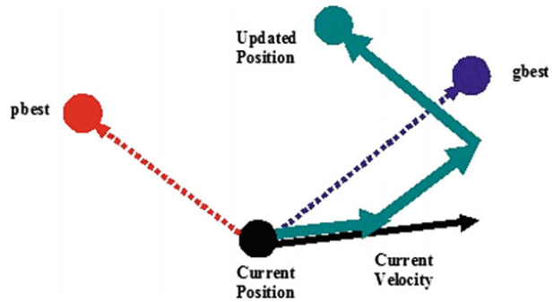

获取更多资讯，赶快关注上面的公众号吧！

@[TOC]

第二章 粒子群优化算法
==============

粒子群优化(PSO)是一种基于群体智能的数值优化算法，由社会心理学家James Kennedy和电气工程师Russell Eberhart于1995年提出。自PSO诞生以来，它在许多方面都得到了改进，这一部分将介绍基本的粒子群优化算法原理和过程。

2.1 粒子群优化
----------

粒子群优化(PSO)是一种群智能算法，其灵感来自于鸟类的群集或鱼群学习，用于解决许多科学和工程领域中出现的非线性、非凸性或组合优化问题。

图1 Russel Eberhart和James Kennedy

### 2.1.1 算法思想

许多鸟类都是群居性的，并由各种原因形成不同的鸟群。鸟群可能大小不同，出现在不同的季节，甚至可能由群体中可以很好合作的不同物种组成。更多的眼睛和耳朵意味着有更多的及时发现食物和捕食者的机会。鸟群在许多方面对其成员的生存总是有益的：

觅食：社会生物学家E.O.Wilson说，至少在理论上，群体中的个体成员可以从其他成员在寻找食物过程中的发现和先前的经验中获益[1]。如果一群鸟的食物来源是相同的，那么某些种类的鸟就会以一种非竞争的方式聚集在一起。这样，更多的鸟类就能利用其他鸟类对食物位置的发现。

抵御捕食者：鸟群在保护自己免受捕食者侵害方面有很多优势。

-   更多的耳朵和眼睛意味着更多的机会发现捕食者或任何其他潜在的危险；

-   一群鸟可能会通过围攻或敏捷的飞行来迷惑或压制捕食者；

-   在群体中，互相间的警告可以减少任何一只鸟的危险。

空气动力学：当鸟类成群飞行时，它们经常把自己排成特定的形状或队形。鸟群中鸟的数量不同，每只鸟煽动翅膀时产生不同的气流，这都会导致变化的风型，这些队形会充分利用不同的分型，从而使得飞行中的鸟类能够以最节能的方式利用周围的空气。

粒子群算法的发展需要模拟鸟群的一些优点，然而，为了了解群体智能和粒子群优化的一个重要性质，值得提一下是鸟群的一些缺点。当鸟类成群结队时，也会给它们带来一些风险。更多的耳朵和眼睛意味着更多的翅膀和嘴，这导致更多的噪音和运动。在这种情况下，更多的捕食者可以定位鸟群，对鸟类造成持续的威胁。一个更大的群体也会需要更多的食物，这导致更多食物竞争，从而可能淘汰群体中一些较弱的鸟类。这里需要指出的是，PSO并没有模拟鸟类群体行为的缺点，因此，在搜索过程中不允许杀死任何个体，而在遗传算法中，一些较弱的个体会消亡。在PSO中，所有的个体都将存活，并在整个搜索过程中努力让自己变得更强大。在粒子群算法中，潜在解的改进是合作的结果，而在进化算法中则是因为竞争。这个概念使得群体智能不同于进化算法。简而言之，在进化算法中，每一次迭代都有一个新的种群进化，而在群智能算法中，每一代都有个体使自己变得更好。个体的身份不会随着迭代而改变。Mataric[2]给出了以下鸟群规则：

1.  安全漫游：鸟类飞行时，不存在相互间或与障碍物间的碰撞；

2.  分散：每只鸟都会与其他鸟保持一个最小的距离；

3.  聚合：每只鸟也会与其他鸟保持一个最大的距离；

4.  归巢：所有的鸟类都有可能找到食物来源或巢穴。

在设计粒子群算法时，并没有采用这四种规则来模拟鸟类的群体行为。在Kennedy和Eberhart开发的基本粒子群优化模型中，对agent的运动不遵循安全漫游和分散规则。换句话说，在基本粒子群优化算法的运动过程中，允许粒子群优化算法中的代理尽可能地靠近彼此。而聚合和归巢在粒子群优化模型中是有效的。在粒子群算法中，代理必须在特定的区域内飞行，以便与任何其他代理保持最大距离。这就相当于在整个过程中，搜索始终停留在搜索空间的边界内或边界处。第四个规则，归巢意味着组中的任何代理都可以达到全局最优。

在PSO模型的发展过程中，Kennedy和Eberhart提出了五个判断一组代理是否是群体的基本原则：

1.  就近原则：代理群体应该能够进行简单的空间和时间计算；

2.  质量原则：代理群体能够对环境中的质量因素作出反应；

3.  多响应原则：代理群体不应在过于狭窄的通道从事活动；

4.  稳定性原则：代理群体不能每次环境变化时就改变其行为模式；

5.  适应性原则：计算代价不大时，代理群体可以改变其行为模式。

### 2.1.2 粒子群优化过程

考虑到这五个原则，Kennedy和Eberhart开发了一个用于函数优化的PSO模型。在粒子群算法中，采用随机搜索的方法，利用群体智能进行求解。换句话说，粒子群算法是一种群智能搜索算法。这个搜索是由一组随机生成的可能解来完成的。这种可能解的集合称为群，每个可能解都称为粒子。

在粒子群优化算法中，粒子的搜索受到两种学习方式的影响。每一个粒子都在向其他粒子学习，同时也在运动过程中学习自己的经验。向他人学习可以称为社会学习，而从自身经验中学习可以称为认知学习。由于社会学习的结果，粒子在它的记忆中存储了群中所有粒子访问的最佳解，我们称之为g~best~。通过认知学习，粒子在它的记忆中储存了迄今为止它自己访问过的最佳解，称为p~best~。

任何粒子的方向和大小的变化都是由一个叫做速度的因素决定的，速度是位置相对于时间的变化率。对于PSO，迭代的是时间。这样，对于粒子群算法，速度可以定义为位置相对于迭代的变化率。由于迭代计数器单位增加，速度v的维数与位置x相同。

对于D维搜索空间，在时间步t下群体中的第i~th~个粒子由D维向量来表示，其速度由另一个D维向量表示。第i~th~个粒子访问过的最优解位置用表示，群体中最优粒子的索引为“g”。第i~th~个粒子的速度和位置分别由下式进行更新：

（1）

（2）

其中为维度，为粒子索引，是群体大小。和为常数，分别称为认知和社交缩放参数，或简单地称为加速系数。和是满足均匀分布[0,1]之间的随机数。上面两个式子均是对每个粒子的每个维度进行单独更新，问题空间中不同维度之间唯一的联系是通过目标函数引入的，也就是当前所找到的最好位置gbest和pbest[3]。PSO的算法流程如下：

创建一个大小为S的D维群体，并初始化对应的速度向量；

算法1：基础粒子群优化算法

### 解读更新等式

速度更新等式（1）的右侧包括三部分3：

1.  前一时间的速度v，可以认为是一动量项，用于存储之前的运动方向，其目的是防止粒子剧烈地改变方向。

2.  第二项是认知或自我部分，通过这一项，粒子的当前位置会向其自己的最好位置移动，这样在整个搜索过程中，粒子会记住自己的最佳位置，从而避免自己四处游荡。这里需要注意的是，是一个方向从到的向量，从而将当前位置向粒子的最佳位置吸引，两者的顺序不能改变，否则当前位置会远离最佳位置。

3.  第三项是社交部分，负责通过群体共享信息。通过该项，粒子向群体中最优的个体移动，即每个个体向群体中的其他个体学习。同样两者应该是。

可以看出，认知尺度参数c1调节的是粒子在其最佳位置方向上的最大步长，而社交尺度参数c2调节的是全局最优粒子方向上的最大步长。图2给出了粒子在二维空间中运动的典型几何图形。

图2 粒子群优化过程中粒子移动的几何说明

从更新方程可以看出，Kennedy和Eberhart的PSO设计遵循了PSO的五个基本原则。在粒子群优化过程中，在d维空间中对一系列时间步进行计算。在任何时间步，种群都遵循gbest和pbest的指导方向，即种群对质量因素作出反应，从而遵循质量原则。由于速度更新方程中有均布随机数r1和r2，在pbest和gbest之间的当前位置随机分配，这证明了响应原理的多样性。在粒子群优化过程中，只有当粒子群从gbest中接收到较好的信息时，才会发生随机运动，从而证明了粒子群优化过程的稳定性原则。种群在gbest变化时发生变化，因此遵循适应性原则。

粒子群优化中的参数
------------------

任何基于种群的算法的收敛速度和寻优能力都受其参数选择的影响。通常，由于这些算法的参数高度依赖于问题参数，因此不可能对这些算法的参数设置给出一般性的建议。但是，已有的理论和/或实验研究，给出了参数值的一般范围。与其他基于种群的搜索算法类似，由于在搜索过程中存在随机因素r1和r2，因此通用PSO的参数调整一直是一项具有挑战性的任务。PSO的基础版本只需要很少的参数。本章只讨论了[4]中介绍的PSO基础版本的参数。

一个基本的参数是群体规模，它通常是根据问题中决策变量的数量和问题的复杂性经验地设置的。一般建议20-50个粒子。

另一个参数是缩放因子c1和c2。如前所述，这些参数决定了下一个迭代中粒子的步长。也就是说，c1和c2决定了粒子的速度。在PSO的基础版本中，选择c1=c2=2。在这种情况下，粒子s速度的增加是不受控制的，这有利于更快的收敛速度，但不利于更好地利用搜索空间。如果我们令c1=c2\>0，那么粒子会吸引到pbest和gbest的平均值。c1\>c2设置有利于多模态问题，而c2\>c1有利于单模态问题。在搜索过程中，c1和c2的值越小，粒子轨迹越平滑，而c1和c2的值越大，粒子运动越剧烈，加速度越大。研究人员也提出了自适应加速系数[5]。

停止准则不仅是粒子群算法的参数，也是任何基于种群的元启发式算法的参数。常用的停止准则通常基于函数评估或迭代的最大次数，该次数与算法所花费的时间成正比。一个更有效的停止准则是基于算法的搜索能力，如果一个算法在一定的迭代次数内没有显著地改进解，那么应该停止搜索。

参考文献

1. O. Wilson, E., *Sociobiology: The New Synthesis.* 1976.

2. J Matari'c, M. and A. Brooks, *Interaction and Intelligent Behavior.* 1999.

3. Trelea, I.C., *The particle swarm optimization algorithm: convergence
analysis and parameter selection.* Information Processing Letters, 2003.
**85**(6): p. 317-325.

4. Kennedy, J. and R. Eberhart. *Particle swarm optimization*. in *Proceedings
of ICNN'95 - International Conference on Neural Networks*. 1995.

5. Zhan, Z., et al. *Adaptive control of acceleration coefficients for particle
swarm optimization based on clustering analysis*. in *2007 IEEE Congress on
Evolutionary Computation*. 2007.
