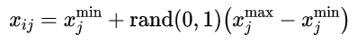

获取更多资讯，赶快关注上面的公众号吧！

@[TOC]

第三章 人工蜂群算法及其改进
====================

3.1 介绍
----

在自然界中，群体是由多个为实现一共同目标的个体构成，目标可以是抵御捕食者、建巢穴、保留或繁殖种群、充分利用环境中的资源等。在群体中为完成目标，存在着任务选择机制和分工，个体根据局部规则和相邻个体间的相互作用进行自组织。这些低层次的交互导致了全局的群体行为。Bonabeau等人[1]将自组织定义为正反馈、负反馈、波动和多重交互作用的组合。正反馈促进个体更频繁地做出有益的行为，或促使其他个体向适当的行为靠拢。蚂蚁分泌信息素或蜜蜂跳舞都是正反馈的例子。由于正反馈效应的存在，当种群趋于饱和时，负反馈机制抛弃了无效的模式。蚂蚁信息素的蒸发或蜜蜂放弃已耗尽的资源就是负反馈的例子。这种波动带来了创造力和创新，以探索新的模式。多重交互是群中相邻代理之间的通信。自组织和分工使群体适应外部和内部的变化。结合上述特点的群体智能具有可扩展性、容错性、适应性、速度快、模块化、自主性、并行性等优点[2]。

蚂蚁、白蚁、蜜蜂、鸟类和鱼类群居生活，在没有监督的情况下共同完成一些任务。这些生物的集体和智能行为启发一些研究人员将集体智能应用到解决问题的技术中。Dorigo[3]的蚁群优化算法和Kennedy和Eberhart[4]的粒子群优化算法都是群体智能算法的例子。

蜂群具有多种智能行为模式，如巢内任务分工、交配、导航、巢址选择、觅食等[5]。蜜蜂通过自组织和分工特性，非常有效地完成觅食任务。被分配到觅食任务的蜜蜂分为三类:雇佣蜂、观察蜂和侦察蜂，这与觅食任务中的劳动分工相对应。雇佣蜂负责开采食物来源，并通过舞蹈招引其他蜜蜂。观察蜂在蜂房中等待，通过观看雇佣蜂的舞蹈来选择食物来源。侦察蜂寻找未知的新资源。被剥削殆尽的食物来源被雇佣蜂抛弃，此时雇佣蜂就变成了侦察蜂。将蜜蜂招引到有利的资源中是一种正反馈现象，而放弃枯竭的资源则是一种负反馈现象。侦察蜂寻找未被发现的食物来源是一种波动效应，它给现有的食物来源带来新的发现。蜜蜂通过舞蹈进行的交流包含了食物源的位置信息和质量信息，这是自组织的多重交互特性。

由Karaboga[6]设计的人工蜂群算法(ABC)是一种模拟蜜蜂觅食行为的群体智能算法，可以成功地用于优化无约束和有约束、单目标和多目标以及连续和组合设计问题[5,
7]。本部分将详细介绍ABC算法及其改进。

3.2 ABC算法
-------

2005年，Karaboga开发了一种模拟蜜蜂觅食行为的优化算法，并将其称为人工蜂群算法(ABC)。该算法使用一群食物源位置，每个食物源都是优化问题的可选方案，而食物源的花蜜量就是该方案的适应度。该算法除了使用蜜蜂执行的各种选择机制外，还使用一些局部和全局搜索机制，试图找到一个最优解(最有利的食物源)。

如前一节所述，蜜蜂根据食物来源的选择类型分为三组，这些类对应于算法的阶段。算法的主要步骤如下：

初始化

repeat

雇佣蜂阶段

观察蜂阶段

记忆当前获得的最优解

侦查蜂阶段

until 达到终止标准

算法1：ABC算法的主要步骤

在初始化阶段，使用下式随机初始化食物源种群：

（1）

其中，是食物源数量，是设计参数的个数（即维度），和分别是第维的下界和上界。

最初的种群是通过雇佣蜂、观察蜂和侦察蜂的觅食循环来改善的，觅食循环将一直迭代至终止准则满足。终止准则可以是达到最大评估次数，也可以是找到一个可接受的函数值。

在雇佣蜂阶段，通过在食物源的领域内进行局部搜索来模拟真实觅食行为中的食物源开采。基础ABC算法的局部搜索由式（2）定义：

（2）

其中是当前解，是随机选择的邻域解，是[-1,1]之间符合均匀分布的随机数。上式定义的局部搜索中，只改变了当前解中随机选择的一个维度（参数）。局部搜索完成后，贪婪选择当前解和变异解中较好的解保留下来，并丢弃较差解。种群中的每个食物源都会应用局部搜索和贪婪选择。

在文献[7]中提出了在局部搜索ABC时的各种改进。

一旦雇佣蜂阶段完成，就开始观察蜂阶段开始。在这一阶段会搜索食物源的邻域，以寻找类似于雇佣蜂阶段中的较优解一样。不同的是，搜索不是在每个解附近逐一执行的，相反，需要搜索的解是根据适应度值随机选择的，也就是说高质量的解将更有可能被选择到，这就是ABC算法的正反馈属性。选择每个解的概率正比于其适应度值：

（3）

计算出概率值后，采用基于适应度值的选择机制以较大机会选择较优解，选择机制可以是轮盘赌、基于排名、随机遍历抽样、锦标赛等，而在基础的ABC中采用的是轮盘赌，这与真实蜂群是类似的，根据雇佣蜂的跳舞信息，更好的食物源会吸引更多蜜蜂的注意。一旦概率性的选择了个解，并在这些解的附近进行局部搜索，然后贪婪搜索以获得更优的解。在雇佣蜂和观察蜂阶段，如果局部搜索无法再改善解，那么其计数器加1，该计数器保存了这个解在种群中被利用和保留的次数，因此这类似于现实中蜜蜂开发食物源的数量。在现实中，就像ABC算法中所模拟的那样，一个食物源的花蜜在开采结束时被耗尽，如果一个食物源被充分开采，这个食物源就会被其蜜蜂抛弃。计数器用于确定开采的充分性和耗尽性，如果计数器超过限制，和该计数器相关联的解被认为已耗尽，然后被通过式（1）随机产生的新解替代。

对于所有阶段，算法包含三个控制参数：食物源数量、循环最大代数和确定食物源耗尽的上限。

对于实参数优化，对ABC算法的改进提高了其收敛性[8]。在基础的ABC算法中，变异解的生成只是通过改变参数向量中一维，而在改进的ABC算法中可以改变多维：

（4）

其中是修改率，由（0,1）上的标准正态分布得到，控制扰动的频率。因此对于每一个维度，如果满足，就通过局部搜索产生，否则等于。

在[8]中，还提出了对的大小的改进。在基础的ABC算法中是[-1,1]之间的随机数，而改进后则是由尺度因子限定的区间得到，是尺度因子，基于Rechenberg的1/5规则进行自动调整以实现微调，即如果成功变异与所有变异的比率小于1/5，则降低，否则增大以加速搜索。

参数定义：

CS：食物源数量，

MCN：最大循环次数，

limit：放弃食物源的最大试验次数，即食物源耗尽上限。

begin

//初始化

for s=1 to CS do

使用式（1）随机生成解；

计算解的适应度值；

初始化试验次数为0.

end

cycle=1；

while cycle\<MCN do

//雇佣蜂阶段

>   for s=1 to CS do

根据式（2）随机生成一个新解；

计算新解的适应度值；

>   //贪婪选择

>   if 新解适应度由于原有解 then

>   用新解替换原有解；

>   else

>   原有解试验次数加1；

>   end

>   end

根据式（3）计算观察蜂选择概率；

//观察蜂阶段（注意，此处仍然需要变异CS次，但是较优解变异次数更多）

>   for s=1 to CS do

根据上面计算的概率选择解并按公式（2）产生新解；

计算新解的适应度值；

>   //贪婪选择

>   if 新解适应度由于原有解 then

>   用新解替换原有解；

>   else

>   原有解试验次数加1；

>   end

end

记忆当前获得的最优解；

//侦查蜂阶段

>   找出试验次数最大的解，超过limit则根据式（1）重新初始化；

>   cycle++；

end

end

算法2

参考文献

1. Bonabeau, E., M. Dorigo, and G. Theraulaz, *Swarm Intelligence - From Natural
to Artificial Systems*. Vol. 14. 1999.

2. Kassabalidis, I., et al. *Swarm intelligence for routing in communication
networks*. in *GLOBECOM'01. IEEE Global Telecommunications Conference (Cat.
No.01CH37270)*. 2001.

3. Dorigo, M., V. Maniezzo, and A. Colorni, *Positive Feedback as a Search
Strategy.* Tech rep., 91-016, Dip Elettronica, Politecnico di Milano, Italy,
1999.

4. Kennedy, J. and R. Eberhart. *Particle swarm optimization*. in *Proceedings
of ICNN'95 - International Conference on Neural Networks*. 1995.

5. Karaboga, D. and B. Akay, *A survey: algorithms simulating bee swarm
intelligence.* Artificial Intelligence Review, 2009. **31**(1-4): p. 61-85.

6. Karaboga, D., *An Idea Based on Honey Bee Swarm for Numerical Optimization,
Technical Report - TR06.* Technical Report, Erciyes University, 2005.

7. Karaboga, D., et al., *A comprehensive survey: artificial bee colony (ABC)
algorithm and applications.* Artificial Intelligence Review, 2012. **42**(1): p.
21-57.

8. Akay, B. and D. Karaboga, *A modified Artificial Bee Colony algorithm for
real-parameter optimization.* Information Sciences, 2012. **192**: p. 120-142.
